**Docker for rookies 🐳**

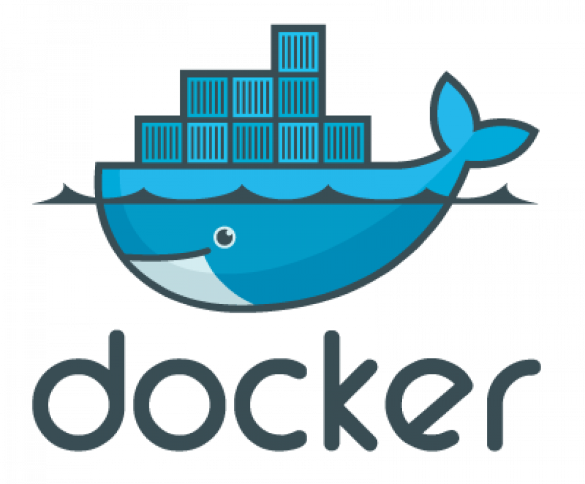

One of those services you may have never used but always hear about is
Docker. Prior to my investigation into the DevOps industry, I had never
heard of or utilized Docker while I was in college. A prerequisite for
joining a modern development team is having a working knowledge of
Docker. Docker has soared to the top of the popularity lists, and
[**[there are good reasons for
this.]{.underline}**](https://www.docker.com/blog/key-insights-from-stack-overflows-2022-developer-survey/#:~:text=Gartner%20believes%20that%2070%25%20of,Data%20courtesy%20of%20Stack%20Overflow.)

This article's goal is to ensure that you understand by the end of it
what the hell Docker is, why we need it, how to set it up on your
laptop, and perhaps even a basic Dockerfile. **(Don't worry! We will
discuss what a Dockerfile is 😏)**

If you are familiar with Docker, you might want to read my posts on
[**[some alternatives I
assessed]{.underline}**](https://medium.com/@devangtomar123/podman-an-alternative-to-docker-desktop-c30370edc98b).
Now let's get started

**Why do we need Docker? ❓🙋🏻‍♂️**

Due to the widespread use of virtual machines on servers, Docker is
required. Using a major company as an example, maintaining these
machines is a full-time job for a company that employs hundreds of
servers with a cluster of virtual machines for each of its platforms. An
OS must be installed on each server, which also requires periodic
updates and patches as well as the installation of dependencies for the
software that each machine runs.

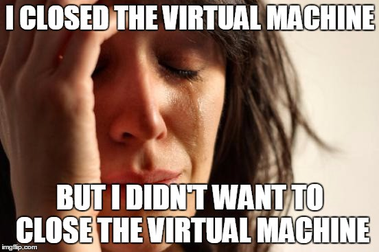

It is clear why this quickly becomes extremely complicated. Since
manually configuring these servers is impractical, many businesses
maintain a list of servers that they routinely update through
programming. This is feasible, but because a team of individuals shares
the list of servers, it is not always accurate. Some servers never
receive updates, which can lead to mistakes that have an effect on
system performance. It can also be a nightmare to debug if there is just
one bad server in a room full of hundreds. How does Docker addresses
this concern? 🤔

**Now what Docker is? 💭**

One solution that made use of the concept of isolated resources was
Docker. It is a collection of tools that enables applications to be
packed with all required dependencies installed and run wherever
desired. The containers are described as follows by Docker:

A container is a standardized software component that wraps up code and
all of its dependencies to ensure that an application will run swiftly
and consistently in different computing environments.

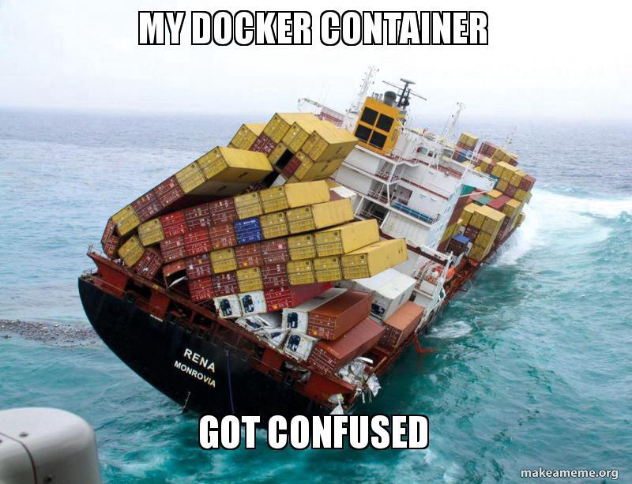

Thoughts like "this is the same as virtual machines" are audible to me,
yet there are some distinctions:

-   Docker containers don't have separate, dedicated hardware-level
    resources that would allow them to operate independently; instead,
    they share the same system resources.

-   They don't have to contain an OS in its entirety.

-   They enable the operation of several workloads on the same OS,
    allowing for resource-efficient resource consumption.

-   They are quite lightweight and effective since they mostly involve
    dependencies at the application-level. A computer that can operate
    two virtual machines and tens of Docker containers without issue
    translates to less resources, lower costs, and happier users.

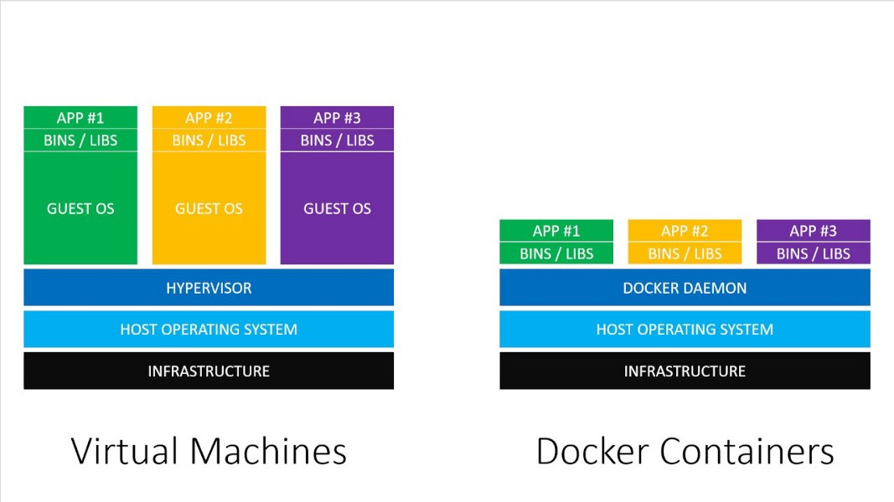

virtual machines

**Now what are Docker images and containers? 😵**

Containers and Docker images are separate concepts, despite being
closely related. Since Docker images cannot be altered, they are
immutable. I have previously explained that rather than running
applications directly on an OS, these images can be uploaded to servers.
Images include all of the files an application requires to run,
including the source code, libraries, dependencies, tools, and other
files. When using Docker, we begin with a base image. Since images can
get very huge, they are made to be comprised of layers of other images
to transmit them over networks using the least amount of data possible.

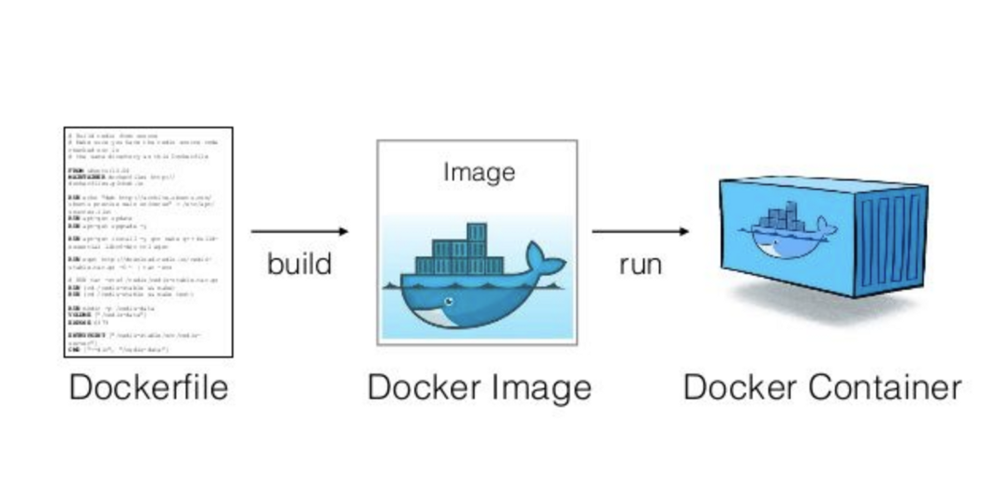

A container is an instance of an image. Containers are instances that
are currently executing and have top writable layers; they execute the
actual applications. The readable layer is also erased when the
container is deleted, but the underlying image is left in tact. The
major lesson here is that you can run several containers off of a single
picture.

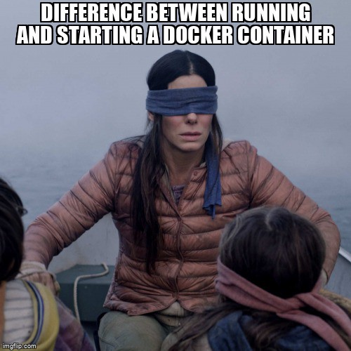

The following metaphor is a helpful way to think about images and
containers: Containers are the cakes you bake, and images are the
recipes for making a cake. A recipe can be used to create as many cakes
as your resources will allow, and an image can be used to create as many
containers as your resources will allow.

**Installing Docker on your machine ⚙️**

-   **For Ubuntu:**

Update your packages first:

\$ sudo apt update

Next, use apt-get to install Docker :

\$ sudo apt install docker.io

Lastly, make sure Docker is properly installed :

Once Docker has been set up. We must confirm it, therefore run the next
command to do so. All of the options that are available for the docker
and that you can use are listed by this command.

\$ docker

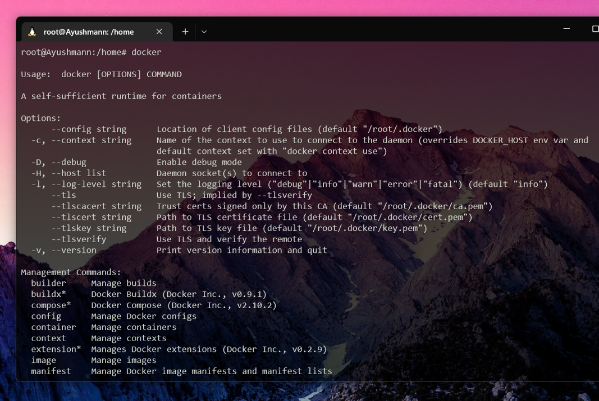

\$ sudo docker run hello-world

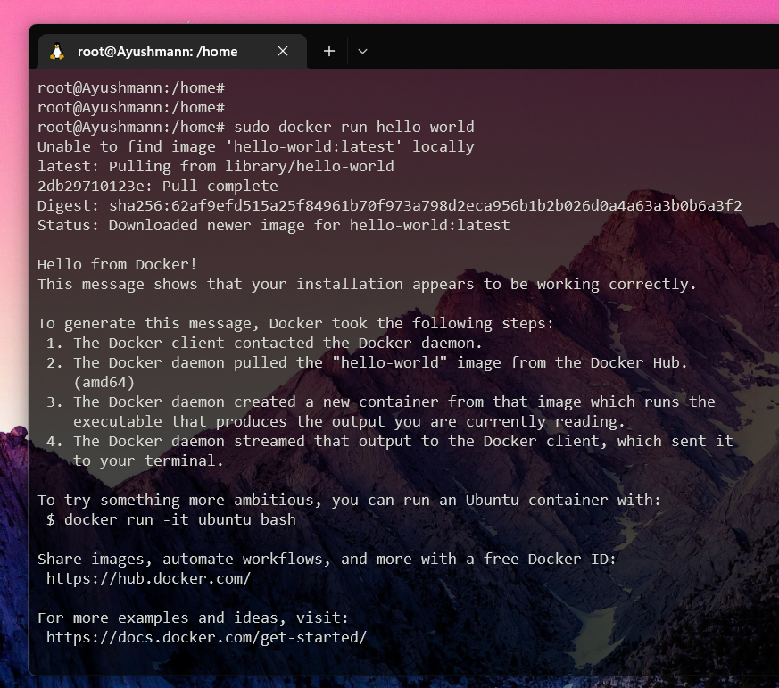

docker image

-   ***For MacOS :*** you can follow [[this
    link]{.underline}](https://docs.docker.com/docker-for-mac/install/).

-   ***For Windows :*** you can follow [[this
    link]{.underline}](https://docs.docker.com/docker-for-windows/install/).

**Now let's create your first application 🙋🏻‍♂️**

Create your first application now that you are familiar with Docker!\
Making a Python program that displays a sentence is the goal of this
brief tutorial.

Dockerfile will be required to start this program. Once you comprehend
the procedure, you'll find that it's not all that difficult.

Reminder: Python won't need to be installed on your machine. The Docker
environment will decide whether to include Python with the intention of
running your code. [[Python installation
guide.]{.underline}](https://www.digitalocean.com/community/tutorials/install-python-windows-10)

**Creating your dockerized application 🌻**

You'll need 2 files :

-   A file named main.py (python file that will contain the code to be
    executed).

-   A file named "Dockerfile" (Docker file that will contain the
    necessary instructions to create the environment).

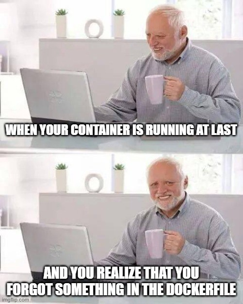

You should typically have the following folder structure :

Also, your Python code may be as straightforward as printing "hello
world"

*import* sys

print(\"Hello there! This is a demo of python script inside Docker
container!\")

print(sys.version)

Here's goes your Dockerfile :

*#Deriving the latest base image*

*FROM* python:latest

*LABEL* *Maintainer=*\"ayushmanndev\"

*WORKDIR* */usr/app/src*

*COPY* *main.py* *./*

*CMD* *\[* \"python\"*,* \"./main.py\"*\]*

You can simply run the following command to create your image once you
have this file and have given it the name Dockerfile :

docker build . -t my-image:my-tag

Once your image has been built, you can execute it by using the
following straightforward command :

docker run -it my-image:my-tag \"python3 ./main.py\"

With the help of this command, you will have access to a shell session
within the container that you can use however you choose. Open a new
terminal window while the one in the container is still open and type

docker ps

To see the following output in order to better comprehend the concept at
this point :

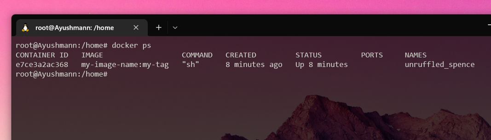

You may see your currently running container by setting the IMAGE column
to your new image, which will display the one that is displayed there.
There is one little exception, though: if you end the shell session
inside the container by typing CTRL+D or exit, your container will shut
down and "docker ps" will produce nothing.

The reason for this behaviour is straightforward: when you ran the
runner command above as :

docker run -it my-image:my-tag \"python3 ./main.py\"

You essentially instructed Docker to start this container with the
"python3 ./main.py" process as the main process inside the container.
This means that once your process is dead, which happens when you exit
the shell session, your container will die, simply as that. 🙋🏻‍♂️

**Push image to DockerHub 📌**

If you want to publish your Docker images, I advise pushing your most
recent creation to DockerHub.

-   Create a DockerHub account first at
    [[https://hub.docker.com]{.underline}](https://hub.docker.com/)

-   Using the CLI, sign in to your DockerHub account :

docker login

-   You can also log out from your CLI using:

docker logout

Furthermore, you can push your newly created Docker image by first
tagging it.

docker tag \<image\> my-image:my-tag\
\<DOCKER_HUB_USERNAME\>/dockerhub:my-image

Next, push the Docker image :

docker push \<DOCKER_HUB_USERNAME\>/dockerhub:my-image

**Conclusion 🤔**

Anyone who feels unprepared to learn about Docker may find this post
helpful. The hardest part of finishing something is frequently beginning
it. If this was helpful or if I missed anything, kindly let me know!

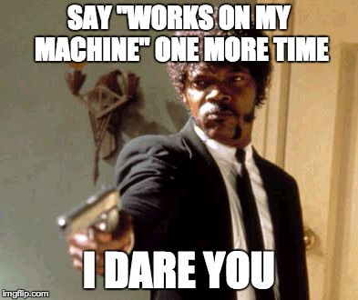

**GitHub URL for this article 💻**

[[**GitHub - devangtomar/medium-docker**\
*You can\'t perform that action at this time. You signed in with another
tab or window. You signed out in another tab
or...*github.com]{.underline}](https://github.com/devangtomar/medium-docker)

**Let's connect and chat! Open to anything under the sun 🏖️🍹**

**🐦 Twitter :**
[[devangtomar7]{.underline}](https://twitter.com/devangtomar7)\
**🔗 LinkedIn :**
[[devangtomar]{.underline}](https://www.linkedin.com/in/devangtomar)\
**📚 Stackoverflow :**
[[devangtomar]{.underline}](https://stackoverflow.com/users/8198097/devangtomar)\
**🖼️ Instagram :**
[[be_ayushmann]{.underline}](https://instagram.com/be_ayushmann)\
Ⓜ️ **Medium :** [[Devang
Tomar]{.underline}](https://medium.com/u/8f5e1c86129d?source=post_page-----e42119a306ca--------------------------------)\
☊ **Hashnode :**
[[devangtomar]{.underline}](https://devangtomar.hashnode.dev/)\
**🧑‍💻 Dev.to :** [[devangtomar]{.underline}](https://dev.to/devangtomar)
